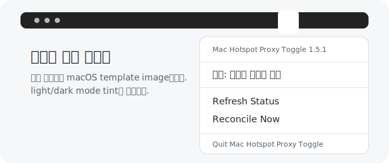
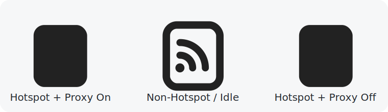

# UI

<p>
  
</p>

Mac Hotspot Proxy Toggle은 menu bar companion과 `MHP.app`을 제공합니다. 핵심 프록시 판단과 macOS proxy write는 계속 `hotspot-proxy-toggle run`이 담당하고, UI는 상태 표시와 사용자의 즉시 실행 진입점 역할만 합니다.

## Menu Bar Companion



위 이미지는 README용 preview입니다. 실제 메뉴바 아이콘은 macOS template image로 렌더링되며, light/dark mode tint를 따릅니다.

Menu bar companion은 `hotspot-proxy-toggle run`/`off`가 쓰는 UI state JSON을 watch해 상태를 갱신합니다. 메뉴 맨 위에는 `Mac Hotspot Proxy Toggle <version>` header를 표시합니다. 메뉴에서 `Settings...`를 선택하면 필수 설정과 자동 시작 상태를 편집합니다. `Refresh Status`를 선택하면 상태만 다시 확인하고, `Reconcile Now`를 선택하면 `hotspot-proxy-toggle run`을 한 번 실행합니다. `Quit Mac Hotspot Proxy Toggle`은 `hotspot-proxy-toggle off`로 proxy setting을 끄고 helper/menu LaunchAgent를 내립니다.

UI state JSON 기본 경로:

```text
~/Library/Application Support/hotspot-proxy-toggle/status.json
```

이 파일에는 SSID, router IP, local path를 넣지 않습니다.

## 상태 아이콘



Menu bar status item은 기본적으로 상태 아이콘만 표시합니다. `MENU_BAR_TITLE`을 지정하면 title 옆에 아이콘을 표시합니다.

```bash
HOTSPOT_MENU_BAR=1 MENU_BAR_TITLE="Mac Hotspot Proxy Toggle" MENU_BAR_REFRESH_SECONDS=60 PROXY_PORT=1080 ./install.sh
```

아이콘은 같은 휴대폰 핫스팟 glyph를 세 가지 형태로 구분합니다.

| 아이콘 | 의미 |
| --- | --- |
| 채워진 휴대폰 | 핫스팟 프록시를 사용 중입니다. |
| 외곽선 휴대폰 | 현재 Wi-Fi가 설정한 핫스팟이 아니거나 핫스팟 프록시가 대기 중입니다. |
| 대각선이 있는 채워진 휴대폰 | 핫스팟은 감지됐지만 프록시를 사용할 수 없습니다. |

macOS menu bar icon은 template image이므로 색상은 macOS가 정하고, glyph의 alpha와 knockout shape만 상태를 표현합니다.

## Menu Status

Menu status는 notification 문맥과 맞춘 5상태를 사용합니다.

- `Hotspot Proxy On`: 핫스팟 프록시를 사용 중입니다.
- `Hotspot Proxy Unavailable`: 핫스팟은 감지됐지만 프록시 서버가 응답하지 않습니다.
- `Hotspot Proxy Idle`: 현재 Wi-Fi가 설정한 핫스팟이 아닙니다.
- `Wi-Fi Not Ready`: Wi-Fi route 또는 router가 아직 준비되지 않았습니다.
- `Hotspot Proxy Error`: 상태를 읽거나 해석하지 못했습니다.

## MHP.app

`MHP.app`은 Finder, Spotlight, Launchpad에서 실행할 수 있는 LSUIElement app입니다. Dock icon을 띄우지 않고 menu bar item만 표시합니다.

App bundle은 핫스팟 프록시 켜짐 상태 glyph를 기반으로 한 아이콘을 사용합니다. Notification은 가능하면 이 app sender를 사용해 같은 app icon으로 표시되게 시도합니다.

## Settings

Settings window는 아래 main settings만 노출합니다.

- `Hotspot SSID`: 단일 휴대폰 핫스팟 SSID.
- `Proxy Type`: `SOCKS5` 또는 `HTTP/HTTPS Web Proxy`.
- `Proxy Port`: 휴대폰 핫스팟 router IP에서 proxy server가 listen하는 port.
- `Language`: `System Default`, `English`, `한국어`.
- `Start Automatically`: background helper와 menu bar app의 login 자동 시작을 함께 켜거나 끄는 단일 toggle. 저장 중 현재 열려 있는 menu app은 종료하지 않습니다.

Advanced에는 troubleshooting용 `Proxy Check Timeout (seconds)`와 `Watchdog Interval (seconds)`만 둡니다.

`NETWORK_SERVICE`와 `WIFI_DEVICE`는 기본적으로 자동 감지하며 Settings에 일반 설정으로 노출하지 않습니다.
